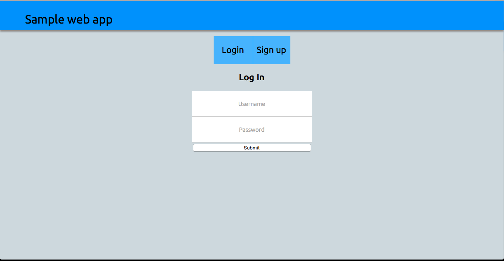
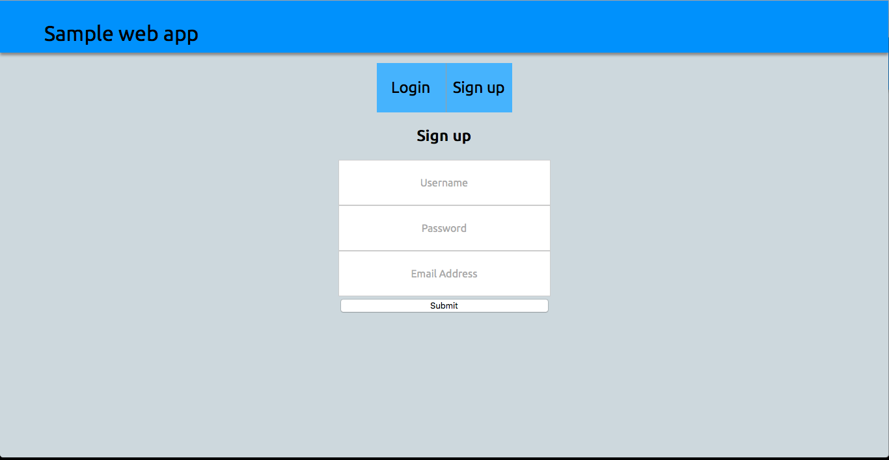
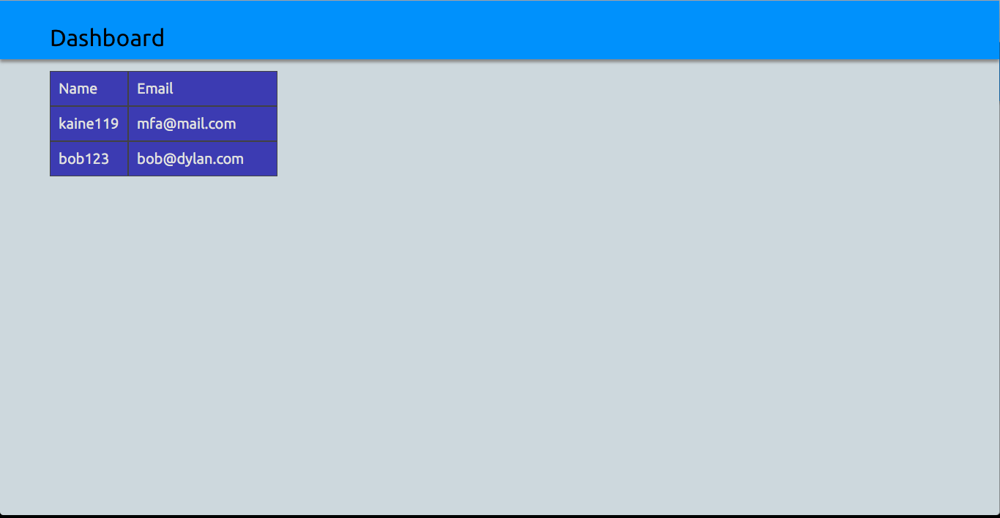

# Sample web app
This is a basic authentication form. Allows for username, password and email addresses.

# Install
The app uses [mongoDB](http://mongodb.org). Install instructions can be found [here](https://docs.mongodb.org/v3.0/installation/).

After installing mongoDB, run
```bash
node index.js
```
to start the server.

Access the webapp in a browser on [http://localhost:3000](http://localhost:3000).

# Screenshots



